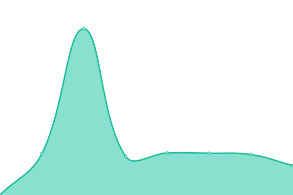
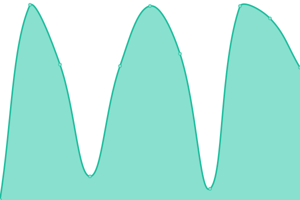

# [📈 Live Status](https://j551n-ncloud.github.io/Monitor): <!--live status--> **🟧 Partial outage**

This repository contains the open-source uptime monitor and status page for [Johannes](https://j551n-ncloud.github.io/Monitor), powered by [Upptime](https://github.com/upptime/upptime).

With [Upptime](https://upptime.js.org), you can get your own unlimited and free uptime monitor and status page, powered entirely by a GitHub repository. We use [Issues](https://github.com/j551n-ncloud/Monitor/issues) as incident reports, [Actions](https://github.com/j551n-ncloud/Monitor/actions) as uptime monitors, and [Pages](https://j551n-ncloud.github.io/Monitor) for the status page.

<!--start: status pages-->
<!-- This summary is generated by Upptime (https://github.com/upptime/upptime) -->
<!-- Do not edit this manually, your changes will be overwritten -->
<!-- prettier-ignore -->
| URL | Status | History | Response Time | Uptime |
| --- | ------ | ------- | ------------- | ------ |
|  [Homepage](https://j551n.com) | 🟥 Down | [homepage.yml](https://github.com/j551n-ncloud/Monitor/commits/HEAD/history/homepage.yml) | 

 422ms
     
 | 

<a href="https://j551n-ncloud.github.io/Monitor/history/homepage">99.10%</a>
    

|  [Recipe](https://recipe.j551n.com) | 🟥 Down | [recipe.yml](https://github.com/j551n-ncloud/Monitor/commits/HEAD/history/recipe.yml) | 

 428ms
     
 | 

<a href="https://j551n-ncloud.github.io/Monitor/history/recipe">99.10%</a>
    

|  [IT Tools](https://tools.j551n.com) | 🟥 Down | [it-tools.yml](https://github.com/j551n-ncloud/Monitor/commits/HEAD/history/it-tools.yml) | 

 409ms
     
 | 

<a href="https://j551n-ncloud.github.io/Monitor/history/it-tools">98.92%</a>
    

|  [Bookstack](https://bookstack.j551n.com) | 🟥 Down | [bookstack.yml](https://github.com/j551n-ncloud/Monitor/commits/HEAD/history/bookstack.yml) | 

 555ms
     
 | 

<a href="https://j551n-ncloud.github.io/Monitor/history/bookstack">98.92%</a>
    

|  [Gitlab](https://gitlab.j551n.com) | 🟥 Down | [gitlab.yml](https://github.com/j551n-ncloud/Monitor/commits/HEAD/history/gitlab.yml) | 

 561ms
     
 | 

<a href="https://j551n-ncloud.github.io/Monitor/history/gitlab">98.92%</a>
    

|  [Vs Code](https://code.j551n.com) | 🟩 Up | [vs-code.yml](https://github.com/j551n-ncloud/Monitor/commits/HEAD/history/vs-code.yml) | 

 529ms
     
 | 

<a href="https://j551n-ncloud.github.io/Monitor/history/vs-code">98.64%</a>
    

|  [Vault](https://vault.j551n.com) | 🟥 Down | [vault.yml](https://github.com/j551n-ncloud/Monitor/commits/HEAD/history/vault.yml) | 

 896ms
     
 | 

<a href="https://j551n-ncloud.github.io/Monitor/history/vault">98.92%</a>
    

|  [Docu sign](https://sign.j551n.com) | 🟥 Down | [docu-sign.yml](https://github.com/j551n-ncloud/Monitor/commits/HEAD/history/docu-sign.yml) | 

 3037ms
     
 | 

<a href="https://j551n-ncloud.github.io/Monitor/history/docu-sign">99.10%</a>
    

|  [Nexterm](https://ssh.j551n.com) | 🟥 Down | [nexterm.yml](https://github.com/j551n-ncloud/Monitor/commits/HEAD/history/nexterm.yml) | 

 384ms
     
 | 

<a href="https://j551n-ncloud.github.io/Monitor/history/nexterm">99.10%</a>
    

|  [Selfhost Spotify](https://dj.j551n.com) | 🟥 Down | [selfhost-spotify.yml](https://github.com/j551n-ncloud/Monitor/commits/HEAD/history/selfhost-spotify.yml) | 

 1512ms
     
 | 

<a href="https://j551n-ncloud.github.io/Monitor/history/selfhost-spotify">97.38%</a>
    

|  [Music Server](https://play.j551n.com) | 🟥 Down | [music-server.yml](https://github.com/j551n-ncloud/Monitor/commits/HEAD/history/music-server.yml) | 

 497ms
     
 | 

<a href="https://j551n-ncloud.github.io/Monitor/history/music-server">97.38%</a>
    

|  [N-Auth](https://auth.j551n.com) | 🟥 Down | [n-auth.yml](https://github.com/j551n-ncloud/Monitor/commits/HEAD/history/n-auth.yml) | 

 665ms
     
 | 

<a href="https://j551n-ncloud.github.io/Monitor/history/n-auth">98.84%</a>
    

<!--end: status pages-->

[**Visit our status website →**](https://j551n-ncloud.github.io/Monitor)

## 📄 License

- Powered by: [Upptime](https://github.com/upptime/upptime)
- Code: [MIT](./LICENSE) © [Anand Chowdhary](https://anandchowdhary.com), supported by [Pabio](https://pabio.com)
- Data in the `./history` directory: [Open Database License](https://opendatacommons.org/licenses/odbl/1-0/)
